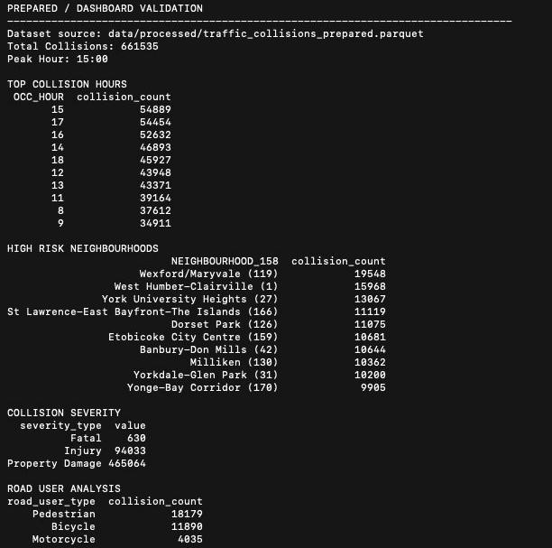

# Toronto Traffic Collision Analytics Tool


---

## Table of Contents
- [Project Overview](#project-overview)
- [Sprint Goal](#sprint-goal)
- [Dataset Information](#dataset-information)
- [Architecture Diagram](#architecture-diagram)
- [Data Analytics Pipeline](#data-analytics-pipeline)
- [Project Structure](#project-structure)
- [Installation & Setup](#installation--setup)
- [How to Run](#️-how-to-run)
- [Results](#results)
- [Dataset Schema Summary](#dataset-schema-summary)
- [TDD Workflow](#tdd-workflow)
- [User Stories](#user-stories)
- [Traceability Matrix](#traceability-matrix)
- [Git Workflow & Naming Conventions](#git-workflow--naming-conventions)
- [Project Team](#project-team)
---

## Project Overview

The **Toronto Traffic Collision Analytics Tool** is a Python-based analytics project that analyzes Toronto traffic collision data to identify safety insights.

This project demonstrates:

• Agile project management  
• Git branch-per-feature workflow  
• Pull request reviews  
• Test Driven Development (TDD)  
• Modular Python analytics design  

Insights produced include:

• collision frequency by hour  
• high-risk neighbourhoods  
• severity patterns  
• vulnerable road user involvement  

---

## Sprint Goal

Develop a modular Python analytics tool capable of loading Toronto traffic collision data and generating actionable safety insights while following Agile development and Git collaboration practices.

---

## Dataset Information

Dataset: **Toronto Traffic Collisions Open Data**

Key columns used in analysis:

| Column | Description |
|------|------|
| OCC_DATE | Date of collision |
| OCC_HOUR | Hour of collision |
| DIVISION | Police division |
| NEIGHBOURHOOD_158 | Neighbourhood |
| FATALITIES | Fatality count |
| INJURY_COLLISIONS | Injury collisions |
| PD_COLLISIONS | Property damage collisions |
| PEDESTRIAN | Pedestrian involvement |
| BICYCLE | Bicycle involvement |
| MOTORCYCLE | Motorcycle involvement |


---

⚠️ **Important — Dataset Not Included in Repository**

The full Toronto collision dataset may exceed GitHub's **100MB file size limit**, therefore it is **not committed to the repository**.

To run the analytics tool, download the dataset and place it in the following location:

```
data/traffic_collisions.csv
```

Example directory structure:

```
toronto-traffic-collision-analytics/
│
├── data/
│   └── traffic_collisions.csv
│
├── src/
├── tests/
├── outputs/
```

The dataset must be **added manually**.


---

## Architecture Diagram

```
Toronto Collision Dataset
        │
        ▼
   Data Loader
        │
        ▼
   Data Cleaning
        │
        ▼
   Analytics Engine
        │
        ├ Hourly Collision Analysis
        ├ Neighbourhood Risk Ranking
        ├ Severity Statistics
        └ Vulnerable Road User Analysis
        │
        ▼
   Visualization / CLI Output
        │
        ▼
        Results
```

---

## Data Analytics Pipeline

```
Raw Dataset
     │
     ▼
Data Ingestion
(load CSV with pandas)
     │
     ▼
Data Cleaning
(remove invalid values)
     │
     ▼
Feature Engineering
(extract time features)
     │
     ▼
Analytics Functions
(groupby analysis)
     │
     ▼
Visualization
(charts saved to outputs)
     │
     ▼
Insights
```

---

## Project Structure

```
toronto-traffic-collision-analytics/

data/
   traffic_collisions.csv

src/
   data_loader.py
   cleaning.py
   analytics.py
   plots.py
   cli_demo.py

tests/
   test_loader.py
   test_cleaning.py
   test_analytics.py

outputs/
   collisions_by_hour.png

README.md
requirements.txt
.gitignore
```

---

## Installation & Setup

Create virtual environment

```
python -m venv .venv
source .venv/bin/activate
```

Install dependencies

```
pip install -r requirements.txt
```

---

## ▶️ How to Run

### 1. Prepare the Dataset (Required)

Run the data preparation script to clean and optimize the dataset.

```
PYTHONPATH=. python src/prepare_dataset.py
```

This step:
- Cleans and standardizes raw data
- Generates derived fields (e.g., severity, flags)
- Optimizes dataset for faster dashboard performance

Output:
data/processed/traffic_collisions_prepared.parquet

---

### 2. Run the CLI Tool (Optional)

```
python -m src.cli_demo
```

The CLI tool:
- Loads the dataset
- Cleans invalid records
- Computes summaries
- Produces charts

---

### 3. Run the Dashboard (Main Application)

```
PYTHONPATH=. streamlit run src/app.py
```

---

### 4. Open in Browser

http://localhost:8501

---

### 5. Run Tests

```
pytest
```

---

## Notes

- Dataset preparation must be completed before running the dashboard
- The dashboard uses the processed dataset for performance optimization
- Default dashboard filters:
  - Latest year
  - Last 90 days
---

## Results


These analytics outputs demonstrate the ability to identify temporal,
geographic, and behavioural patterns within Toronto traffic collision data.

### Collision Summary

```
Total Collisions: 28,000+
Peak Hour: 17:00
```
### Key Collision Insights



---

## Dataset Schema Summary

| Field | Analytical Usage |
|------|------|
| OCC_DATE | time-based analysis |
| OCC_HOUR | hourly pattern detection |
| NEIGHBOURHOOD_158 | location risk ranking |
| FATALITIES | severity analysis |
| PEDESTRIAN | vulnerable user analysis |

---

## TDD Workflow

The project follows **Test Driven Development**.

Red → Green → Refactor cycle

```
1 Write failing test
2 Implement minimal code
3 Run tests until they pass
4 Refactor safely
```

Example commit sequence

```
test(US-06): add failing hourly test
feat(US-06): implement hourly summary
refactor(US-06): improve validation
```

---

## User Stories

### Detailed User Stories

### US-01 — Project Repository Setup (2 Story Points)

Acceptance Criteria:

- Git repository initialized
- Standard project folder structure created

```
data/
src/
tests/
outputs/
notebooks/
```

- `.gitignore` configured
- `requirements.txt` created
- Base `README.md` added

---

### US-02 — User Story Identification (1 Story Point)

Acceptance Criteria:

- Product backlog created
- Story includes description and story points

---

### US-03 — Sprint Planning (1 Story Point)

Acceptance Criteria:

- Stories prioritized into sprints
- Story points assigned
- Team members assigned responsibilities

---

### US-04 — Load Dataset to Analyze and Process (2 Story Points) **[TDD]**

Acceptance Criteria:

- Reads the Toronto collision dataset into a pandas DataFrame
- Validates required columns exist
- Raises a clear error when required columns are missing
- Includes a demo showing successful dataset loading

---

### US-05 — Clean Data (5 Story Points) **[TDD]**

Acceptance Criteria:

- Converts OCC_DATE to datetime format
- Converts numeric columns such as OCC_YEAR and OCC_HOUR
- Removes invalid coordinates (LAT_WGS84 or LONG_WGS84 equal to 0)
- Handles placeholder neighbourhood values
- Cleaning logic implemented in `clean_collision_data(df)`

---

### US-06 — Collisions by Hour (3 Story Points) **[TDD]**

Acceptance Criteria:

- Groups collisions by OCC_HOUR
- Returns hourly collision counts
- Identifies peak collision hours
- Output displayed in CLI demo

---

### US-07 — Collisions by Neighbourhood (3 Story Points) **[TDD]**

Acceptance Criteria:

- Groups collisions by NEIGHBOURHOOD_158
- Returns top neighbourhoods by collision count
- Results sorted by collision frequency

---

### US-08 — Generating Charts to Interpret Patterns (5 Story Points)

Acceptance Criteria:

- Generates charts for collision trends
- Includes collision by hour visualization
- Includes top neighbourhood visualization
- Charts saved to the outputs folder

---

### US-09 — Automated Tests (3 Story Points)

Acceptance Criteria:

- Unit tests implemented using pytest
- Tests validate loader, cleaning, and analytics modules
- All tests pass successfully

---

### US-10 — Collision Severity Analysis (3 Story Points) **[TDD]**

Acceptance Criteria:

- Summarizes fatalities, injury collisions, and property damage collisions
- Outputs severity summary table
- Results available in CLI demo and dashboard

---

### US-11 — Road User Analysis (3 Story Points)

Acceptance Criteria:

- Counts collisions involving pedestrians
- Counts collisions involving bicycles
- Counts collisions involving motorcycles
- Displays results in summary output

---

### US-12 — Create Interactive Dashboard to View Collision Analytics (8 Story Points)

Acceptance Criteria:

- Dashboard implemented using Streamlit
- Displays key metrics and charts
- Allows user interaction with filters
- Shows collision summaries visually

---

### US-13 — Export Results (2 Story Points)

Acceptance Criteria:

- Allows exporting analytics results to CSV
- Export file saved in outputs folder
- Export works from CLI or dashboard

---

### US-14 — Filtering Feature (5 Story Points)

Acceptance Criteria:

- Allows filtering dataset by year
- Allows filtering by division
- Allows filtering by neighbourhood
- Filtered results update analytics outputs

---

### US-15 — Refactor Codebase (3 Story Points)

Acceptance Criteria:

- Improves code structure and readability
- Ensures modular design of analytics functions
- Maintains existing functionality
- All tests continue to pass

---

## User Story Overview

### Sprint 1

| Story ID | User Story | Points | TDD |
|----------|------------|--------|-----|
| US-01 | Project Repository Setup | 2 | No |
| US-02 | User Story Identification | 1 | No |
| US-03 | Sprint Planning | 1 | No |
| US-04 | Load Dataset | 2 | Yes |
| US-05 | Clean Data | 5 | Yes |
| US-06 | Collisions by Hour | 3 | Yes |
| US-07 | Collisions by Neighbourhood | 3 | Yes |
| US-08 | Generate Charts | 5 | No |
| US-09 | Automated Tests | 3 | No |

---

### Sprint 2

| Story ID | User Story | Points | TDD |
|----------|------------|--------|-----|
| US-10 | Collision Severity Analysis | 3 | Yes |
| US-11 | Road User Analysis | 3 | No |
| US-12 | Interactive Dashboard | 8 | No |
| US-13 | Export Results | 2 | No |
| US-14 | Filtering Feature | 5 | No |
| US-15 | Refactor Codebase | 3 | No |

---

### Total Story Points

**49 Story Points**

---

## TDD Stories

The following stories were implemented using **Test Driven Development**:

- US-04 — Load Dataset
- US-05 — Clean Data
- US-06 — Collisions by Hour
- US-07 — Collisions by Neighbourhood
- US-10 — Collision Severity Analysis

Each story followed the **Red → Green → Refactor** workflow.

---

## Traceability Matrix


| User Story | Branch | Tag | PR Title |
|-------------|--------|------|----------|
| US-01 | chore/US-01-repo-setup | US-01-COMPLETE | US-01: Project repository setup |
| US-04 | feature/US-04-data-loader | US-04-COMPLETE | US-04: Load dataset |
| US-05 | feature/US-05-data-cleaning | US-05-COMPLETE | US-05: Clean collision data |
| US-06 | feature/US-06-collisions-by-hour | US-06-COMPLETE | US-06: Collision analysis by hour |
| US-07 | feature/US-07-collisions-by-neighbourhood | US-07-COMPLETE | US-07: Collision analysis by neighbourhood |
| US-08 | feature/US-08-charts | US-08-COMPLETE | US-08: Chart generation |
| US-09 | test/US-09-automated-tests | US-09-COMPLETE | US-09: Automated tests |
| US-10 | feature/US-10-Collision-severity-analysis | US-10-COMPLETE | US-10: Collision severity analysis |
| US-11 | TT06-road-user-analysis | US-11-COMPLETE | US-11: Road user analysis |
| US-12 | feature/US-12-dashboard-enhancements | US-12-COMPLETE | US-12: Interactive analytics dashboard |
| US-13 | TT06-road-user-analysis | US-13-COMPLETE | US-13: Export analytics results |
| US-14 | tdd-filtering | US-14-COMPLETE | US-14: Dataset filtering feature |
| US-15 | refactor/US-15-code-refactor | US-15-COMPLETE | US-15: Refactor codebase |
---

## Git Workflow & Naming Conventions

### Branch Strategy

This project follows a **feature-branch workflow** using the `main` branch as the integration branch.

All development work is done in separate working branches and merged into `main` through Pull Requests.

**Main branch**

- `main`  
  Stable branch containing the latest working version of the project.

No direct commits should be made to `main`.

---

### Working Branch Types

Branch format:

type/US-##-short-description

Supported branch types:

- `feature/` – new functionality
- `fix/` – bug fixes
- `docs/` – documentation updates
- `test/` – adding or updating tests
- `chore/` – setup or maintenance tasks
- `refactor/` – internal code improvements without changing functionality
- `merge/` – merge-related maintenance if needed

---

### Branch Naming Examples

```
feature/US-03-data-loader
feature/US-06-hourly-summary
fix/US-04-date-parsing
docs/US-01-readme-update
test/US-06-hourly-tests
chore/US-00-project-setup
refactor/US-06-hourly-cleanup
```

---

### Commit Message Convention

Commit message format:

TYPE(US-##): short description

Recommended commit types:

- `feat` – new feature
- `fix` – bug fix
- `docs` – documentation update
- `test` – add or update tests
- `chore` – setup or maintenance task
- `refactor` – internal code improvement
- `merge` – merge commit

---

### Commit Message Examples

```
feat(US-03): implement collision dataset loader
test(US-03): add failing loader tests
fix(US-04): correct date conversion bug
docs(US-01): update README structure
chore(US-00): initialize repository structure
refactor(US-06): simplify hourly summary logic
merge: merge feature/US-06-hourly-summary into main
```

---

### Pull Request Title Format

```
US-##: short description
```

Examples

```
US-03: Add collision dataset loader
US-04: Add data cleaning utilities
US-06: Add hourly collision summary
US-07: Add neighbourhood collision analysis
```

---

### Merge Workflow

```
working branch
      ↓
Pull Request
      ↓
Code Review
      ↓
Merge into main
```

Rules

- Do not commit directly to `main`
- Each user story should have its own branch
- All changes must go through a Pull Request
- Pull Requests must reference the corresponding User Story
- Pull Requests must be reviewed before merging

---

### TDD Commit Sequence Example

```
test(US-06): add failing hourly collision test
feat(US-06): implement hourly collision summary
refactor(US-06): improve validation logic
```

---


## Repository Metrics
<!-- METRICS:START -->
<!-- METRICS:END -->

<!-- REPO-STATS:START -->
## Repository Statistics

**Total Commits:** 141  
**Total Team Members:** 4  
**Branches Created:** 1

### Team Contribution Summary

| Team Member | GitHub Username | Commits | PRs | Files Changed | Insertions | Deletions | Status |
|-------------|-----------------|---------|-----|---------------|------------|-----------|--------|
| Hilfritz Camallere | `hilfritz` | 70 | 14 | 96 | 6063 | 1645 | Active contributor |
| Ananya Mandal | `AnanyaMandal-DataAnalyst` | 16 | 4 | 19 | 498 | 135 | Active contributor |
| Daniyal Khan | `daniyalnkh` | 5 | 2 | 3 | 143 | 0 | Active contributor |
| Joseph Jamoralin | `Joseph-dataanalyst` | 6 | 2 | 6 | 122 | 10 | Active contributor |

### Contributor Statistics

| Contributor | Commits | Files Changed | Insertions | Deletions |
|-------------|---------|---------------|------------|-----------|
| Hilfritz Camallere | 70 | 96 | 6063 | 1645 |
| Ananya Mandal | 16 | 19 | 498 | 135 |
| Joseph Jamoralin | 6 | 6 | 122 | 10 |
| Daniyal Khan | 5 | 3 | 143 | 0 |

### Commit Type Distribution

| Type | Count |
|------|------:|
| docs | 53 |
| feat | 12 |
| fix | 9 |
| other | 54 |
| refactor | 8 |
| test | 5 |

### File Metrics

| Metric | Value |
|--------|------:|
| Python Files | 28 |
| Source Files | 15 |
| Test Files | 10 |
| Markdown Files | 2 |

### Pull Request Statistics

**Total Pull Requests:** 22  
**Merged Pull Requests:** 21  
**Open Pull Requests:** 0

| PR # | Title | State | Author |
|------|-------|-------|--------|
| 22 | fix(US-15): clean repository, update .gitignore, and improve stats generation | MERGED | hilfritz |
| 21 | US-15: Refactor codebase and modularize analytics functions | MERGED | hilfritz |
| 20 | feat(US-06): Day-of-Week and Monthly Analysis with TDD + Refactor | MERGED | daniyalnkh |
| 19 | feat(US-12): add day-of-week and monthly analysis to dashboard | MERGED | daniyalnkh |
| 18 | US-14: Filtering Feature | MERGED | AnanyaMandal-DataAnalyst |
| 17 | US-09: Automated Tests | MERGED | Joseph-dataanalyst |
| 16 | road_user_analysis | CLOSED | AnanyaMandal-DataAnalyst |
| 15 | US-12: Interactive Collision Analytics Dashboard | MERGED | hilfritz |
| 14 | US-10: Feature Collision Severity Analysis | MERGED | Joseph-dataanalyst |
| 13 | US - 11 road user analysis | MERGED | AnanyaMandal-DataAnalyst |
| 12 | US-07: Add collision analysis by neighbourhood | MERGED | hilfritz |
| 11 | US-08-Generating charts to interpret patterns | MERGED | AnanyaMandal-DataAnalyst |
| 10 | US-06: Add collision analysis by hour | MERGED | hilfritz |
| 9 | US-01: Fix CI workflow for repository statistics generation | MERGED | hilfritz |
| 8 | US-01: Fix repository statistics workflow history depth | MERGED | hilfritz |
| 7 | US-01: Fix team mapping in repository statistics generation | MERGED | hilfritz |
| 6 | US-01: Add GitHub Actions workflow for automated repository statistics | MERGED | hilfritz |
| 5 | US-01: Add GitHub Actions workflow for automated repository statistics | MERGED | hilfritz |
| 4 | US-01: Add repository statistics automation for README documentation | MERGED | hilfritz |
| 3 | US-05: Implement collision data cleaning | MERGED | hilfritz |
| 2 | US-04: Load dataset | MERGED | hilfritz |
| 1 | US-01: Project repository setup | MERGED | hilfritz |

<!-- REPO-STATS:END -->
---

## Project Team

This project was collaboratively developed during a two-week Agile sprint at the University of Niagara Falls (Master of Data Analytics — Winter 2026).


- **Hilfritz Camallere**  
  GitHub: https://github.com/hilfritz  

- **Ananya Mandal**  
  GitHub: https://github.com/AnanyaMandal-DataAnalyst  

- **Daniyal Khan**  
  GitHub: https://github.com/daniyalnkh  

- **Joseph Jamoralin**  
  GitHub: https://github.com/Joseph-dataanalyst 

